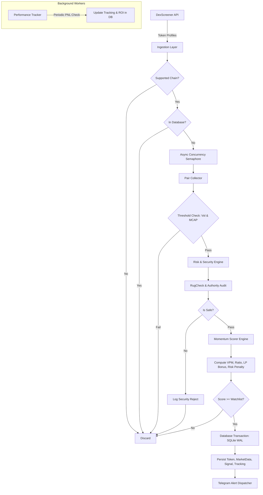

# CRYPTO_ALPHA_SNIPER Architecture Blueprint

## System Overview

CRYPTO_ALPHA_SNIPER is engineered as a modular, high-throughput asynchronous crypto intelligence platform. It decouples token discovery, security analysis, momentum scoring, persistence, and alert dispatching into independent lifecycle stages.

---

## Core Components

### 1. Ingestion Layer (`src/collectors/dexscreener.py`)
- Interfaces with DexScreener's `/token-profiles/latest/v1` and `/latest/dex/tokens/{address}` endpoints.
- Implements `httpx.AsyncClient` with connection pooling, custom User-Agents, exponential backoff, and rate limit handling.

### 2. Security & Risk Engine (`src/analyzers/risk_engine.py`)
- Audits smart contract safety before token analysis.
- Connects to RugCheck API on Solana to verify:
  - **Mint Authority**: Confirms if the developer can inflate token supply infinitely.
  - **Freeze Authority**: Confirms if the developer can blacklist token holders from selling.
  - **Top Holder Concentration**: Evaluates top 10 holders' ownership percentage.
  - **Risk Score Derivation**: Generates a normalized score (0 = Safe, 100 = Critical Danger).

### 3. Momentum Scorer (`src/engine/scorer.py`)
- Preserves the proven momentum scoring logic of ALPHA_SNIPER:
  - **Age factor**: Favors younger tokens (<= 10 mins: +25 pts).
  - **Volume brackets**: 1-hour volume depth (>= $100k: +20 pts).
  - **Velocity (VPM)**: Volume Per Minute (>= $5k/min: +30 pts).
  - **Buy Pressure**: Buy/Sell transaction ratio (>= 2.0: +20 pts).
  - **Liquidity bonus**: Depth of LP (>= $20k: +10 pts).
  - **Social bonus**: Verified links (+5 pts).
  - **Risk Penalty**: Deducts points proportionally for elevated risk scores.

### 4. Storage & Persistence (`src/database/`)
- Relational mapping via SQLAlchemy 2.0 and `aiosqlite`.
- SQLite configured in **WAL (Write-Ahead Logging)** mode with `PRAGMA synchronous=NORMAL` and indexed foreign keys for zero-lock concurrency.

### 5. Notification Dispatcher (`src/services/telegram.py`)
- Formats rich HTML messages with safety badges, metrics, and direct links to charting interfaces.
- Handles Telegram API rate limits (HTTP 429 Retry-After).

### 6. Autonomous ROI Tracker (`src/services/tracker.py`)
- Executes periodic batch audits on spotted tokens.
- Calculates current Market Cap vs. Entry Market Cap to track historical signal accuracy.
