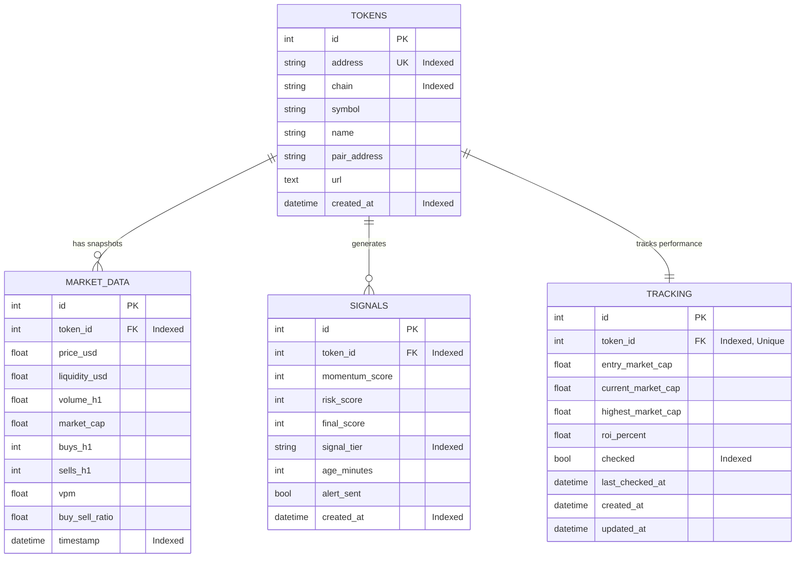

# Database Schema & Design

CRYPTO_ALPHA_SNIPER uses an indexed relational schema managed by SQLAlchemy 2.0 Async ORM with SQLite in WAL (Write-Ahead Logging) mode.

## Entity Relationship Diagram (ERD)



---

## SQLite Performance Optimizations

When initializing the database engine, the following SQLite PRAGMAs are executed:

1. `PRAGMA journal_mode=WAL;`
   - Enables Write-Ahead Logging.
   - Readers never block writers, and writers never block readers.
2. `PRAGMA synchronous=NORMAL;`
   - Drastically reduces disk I/O overhead without sacrificing database integrity.
3. `PRAGMA busy_timeout=5000;`
   - Sets a 5-second automatic wait buffer before throwing busy errors if multiple background tasks write simultaneously.

---

## Legacy Data Migration

To import historical tokens from legacy JSON flat files:

```bash
python -m src.database.migration
```

The migration script safely converts `processed_tokens.json` and `candidates.json` into relational records with duplicate address deduplication.

---

## 🧹 Automated Data Retention & Cleanup Policy

To prevent the SQLite database from growing excessively on long-running 24/7 server deployments, **CRYPTO_ALPHA_SNIPER** includes an autonomous retention purger (`src/database/cleanup.py`).

### How It Works:
1. **Periodic Trigger**: Every 6 hours, the background `PerformanceTracker` worker executes `purge_expired_records()`.
2. **Cascade Purging**: Identifies all `tokens` where `created_at < now - DATA_RETENTION_DAYS` (default: **7 days**). Deleting the token automatically and atomically cascades to delete all linked `market_data`, `signals`, and `tracking` records.
3. **Storage Optimization**: Executes `PRAGMA optimize;` to maintain fast indexing and query speeds.

### Configuration (`.env`):
```env
# Number of days to retain historical records before auto-deletion (Default: 7)
DATA_RETENTION_DAYS=7

# Enable/disable automated cleanup (Default: true)
AUTO_CLEANUP_ENABLED=true
```
