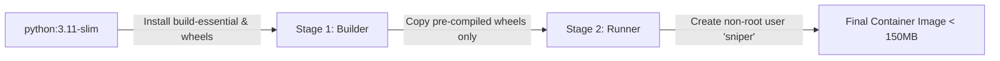

# Docker & Containerization Guide

This document details the multi-stage Docker architecture, image building, volume persistence, and logging for **CRYPTO_ALPHA_SNIPER**.

---

## 🏗️ Multi-Stage Docker Architecture

The [`Dockerfile`](../Dockerfile) uses a two-stage build to minimize image size and eliminate build tools from the final runtime image:



### Security Highlights
* **Non-Root Execution**: Runs under system user `sniper` (UID: 1000) instead of `root`.
* **Zero Secret Leakage**: No `.env` files are baked into the image layers.
* **Minimal Attack Surface**: Strips compilation toolchains (`gcc`, `make`) from final layer.

---

## 🚀 Quick Execution Commands

### Build and Start Container
```bash
docker compose up -d --build
```

### View Real-Time Structured Logs
```bash
docker compose logs -f crypto_alpha_sniper
```

### Inspect Container Resource Usage
```bash
docker stats crypto_alpha_sniper
```

### Gracefully Stop Container
```bash
docker compose down
```

---

## 💾 Persistent Volumes

The container mounts two local host volumes defined in `docker-compose.yml`:

```yaml
volumes:
  - ./data:/app/data   # Persists SQLite WAL database (crypto_alpha_sniper.db)
  - ./logs:/app/logs   # Persists rotated Loguru logs (crypto_alpha_sniper.log)
```

* **Data Preservation**: Upgrading or rebuilding container images will **never** delete your historical database or logs.

---

## 🪵 Docker Logging Configuration

`docker-compose.yml` includes automated log rotation for stdout/stderr to prevent disk exhaustion:

```yaml
logging:
  driver: "json-file"
  options:
    max-size: "20m"
    max-file: "5"
```
