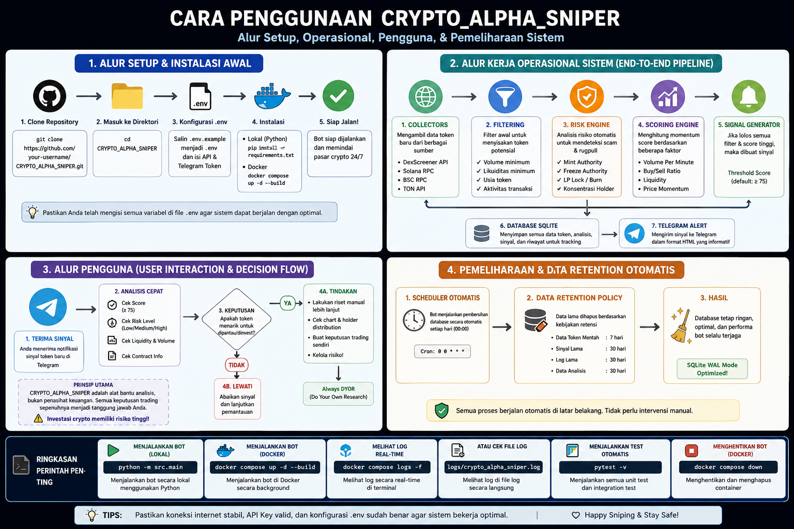

# Getting Started with CRYPTO_ALPHA_SNIPER 🚀

This tutorial guides you through setting up and running **CRYPTO_ALPHA_SNIPER** from scratch in under 5 minutes.

---

<p align="center">
  
</p>

---

## Step 1: Clone the Repository

Clone the project from GitHub and navigate into the root directory:

```bash
git clone https://github.com/nuexn0x-9/CRYPTO_ALPHA_SNIPER.git
cd CRYPTO_ALPHA_SNIPER
```

---

## Step 2: Set Up Python Environment

Ensure you have **Python 3.11+** installed:

```bash
python --version
```

Create an isolated virtual environment:

```bash
# Linux / macOS:
python3 -m venv .venv
source .venv/bin/activate

# Windows (Command Prompt / PowerShell):
python -m venv .venv
.venv\Scripts\activate
```

Install all required production and testing dependencies:

```bash
pip install -r requirements.txt
```

---

## Step 3: Configure Environment Variables

Create your local `.env` configuration file from the provided template:

```bash
cp .env.example .env
```

Open `.env` in your text editor:

```env
# Optional: Enter your Telegram Bot credentials to receive alerts
TELEGRAM_BOT_TOKEN=123456789:ABCdefGhIJKlmNoPQRstuvWxyz
TELEGRAM_CHAT_ID=-1001234567890

# Scanner Engine Tuning
SCAN_INTERVAL_SECONDS=60
SUPPORTED_CHAINS=solana,bsc,ton
MAX_ALLOWED_RISK_SCORE=65

# Automatic Database Retention (Days to keep data)
DATA_RETENTION_DAYS=7
```

> **Note**: If you leave `TELEGRAM_BOT_TOKEN` empty, the scanner will still run normally and output signals directly to the console and SQLite database.

---

## Step 4: Run the Engine

Start the scanner supervisor:

```bash
python -m src.main
```

You will see the colorized startup banner and initial scanner cycle:

```text
======================================================================
  CRYPTO_ALPHA_SNIPER - High-Throughput Intelligence Engine           
======================================================================
2026-08-27 10:00:00 | INFO     | src.main:main:63 - Initializing CRYPTO_ALPHA_SNIPER v1.0.0...
2026-08-27 10:00:00 | INFO     | src.main:main:64 - Supported Chains : solana,bsc,ton
2026-08-27 10:00:00 | INFO     | src.main:main:65 - Database Target  : sqlite+aiosqlite:///data/crypto_alpha_sniper.db
2026-08-27 10:00:00 | INFO     | src.main:main:66 - Telegram Alerts  : ENABLED
2026-08-27 10:00:01 | INFO     | src.engine.scanner:scan_cycle:135 - [10:00:01] SCANNING DEX PROFILES...
```

---

## Step 5: Receive Signals

When a candidate token satisfies the minimum volume, liquidity depth, momentum thresholds, and passes RugCheck security audits, an alert is formatted and broadcast to your Telegram:

```text
🔥 ALPHA SIGNAL (SAMPLE)

⛓️ Chain: SOLANA
⭐ Alpha Score: 85/100 (Momentum: 85)
🛡️ Safety: 🟢 Low Risk (15/100)

⏳ Age: 5 mins
📊 Volume (1h): $65,000
⚡ VPM: $13,000.0/min
📈 Buy/Sell Ratio: 3.50
💧 Liquidity (LP): $25,000
💰 Market Cap: $45,000
🟢 Buys: 120  |  🔴 Sells: 34

🏦 Pair: 675kPX9MHTjS2zt1qfr1NYHuzeLXfQM9H24wFSUt1Mp8
📍 CA: 6BeyohhmEkxxBsKsne2rLUjkVpx1uQ1jw4KVB9uTpump

🔗 View on DexScreener
```

---

## Next Steps

* Read the [Configuration Guide](configuration.md) to fine-tune signal sensitivity.
* Learn about the [Scoring Formulas](scoring-system.md) and [Risk Verification](risk-engine.md).
* Deploy to a cloud server using the [Docker Guide](docker-guide.md).
