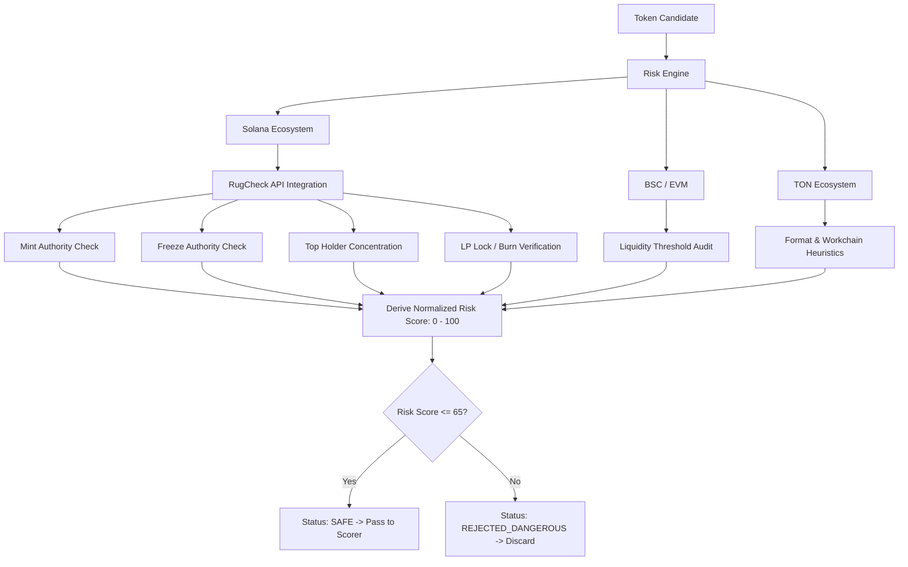

# Security & Risk Engine

The **Security & Risk Engine** (`src/analyzers/risk_engine.py`) provides automated smart contract auditing and vulnerability heuristics to protect users from honeypots, rugpulls, and predatory token mechanics.

> **Important**: A low risk score indicates that common known attack vectors were not detected at the time of scanning. It does **NOT** guarantee that a token is 100% safe from novel exploit mechanisms.

---

## 🛡️ Evaluated Security Vectors



---

## 🔍 Specific Risk Checks

### 1. Mint Authority Verification
* **The Danger**: If the mint authority is not permanently revoked (set to `null`), the token creator can mint unlimited new tokens at zero cost and dump them on the liquidity pool, crashing the price to zero.
* **Engine Action**:
  * Mint authority enabled: $+35\text{ Risk Points}$, flags `Mint Authority is still ENABLED`.
  * For Pump.fun tokens (`*.pump`), mint authority is mathematically revoked by the bonding curve smart contract.

### 2. Freeze Authority Verification
* **The Danger**: If the freeze authority is enabled, the creator can selectively freeze token accounts, preventing target investors from selling (honeypot mechanism).
* **Engine Action**:
  * Freeze authority enabled: $+30\text{ Risk Points}$, flags `Freeze Authority is still ENABLED`.

### 3. Top Holder Concentration
* **The Danger**: If a single wallet or developer cluster owns a disproportionate fraction of the total supply (excluding bonding curves/DEX LP), a single sell transaction can drain the liquidity pool.
* **Engine Action**:
  * If top 1 holder holds $> 30\%$ of total supply: $+20\text{ Risk Points}$, flags `Top 1 holder owns XX% of supply`.

### 4. RugCheck Vulnerability Flags
* Integrates with the RugCheck API (`/v1/tokens/{address}/report`).
* Parses explicit danger ratings (`risks[].level == "danger"`): $+25\text{ Risk Points}$ per danger flag.
* Parses warning ratings (`risks[].level == "warn"`): $+10\text{ Risk Points}$ per warning flag.

---

## 🚦 Risk Score Spectrum

| Risk Score | Risk Category | Action Taken |
| :--- | :--- | :--- |
| **$0 - 25$** | 🟢 **Low Risk** | Allowed to proceed to scoring with zero penalty. |
| **$26 - 50$** | 🟡 **Medium Risk** | Allowed to proceed; proportional risk penalty applied. |
| **$51 - 65$** | 🟠 **Elevated Risk** | Allowed only if momentum score is exceptionally high. |
| **$> 65$** | 🔴 **Critical Danger** | **Auto-Rejected**. Discarded before signal generation. |

---

## ⚙️ Configuration

The maximum acceptable risk threshold can be adjusted in `.env`:

```env
# Maximum allowable risk score (0 to 100)
MAX_ALLOWED_RISK_SCORE=65
```
