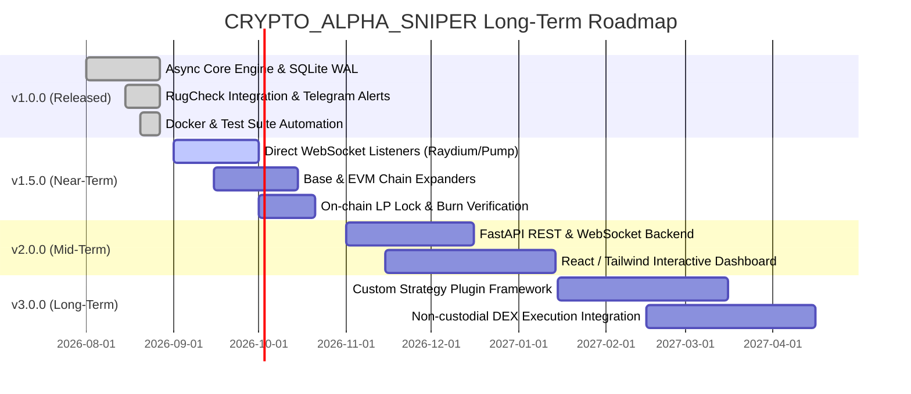

# Project Roadmap & Vision 🗺️

This document outlines the strategic engineering roadmap for **CRYPTO_ALPHA_SNIPER**.

---

## 🎯 Release Milestones

---

## 📌 Detailed Version Goals

### 🟢 v1.0.0 — Core Intelligence Engine *(Current Release)*
- [x] Asynchronous pipeline (`asyncio` + `httpx.AsyncClient`)
- [x] Production SQLite WAL database with SQLAlchemy 2.0 ORM
- [x] Automated RugCheck safety evaluation and authority checks
- [x] Multi-factor momentum scoring engine
- [x] Autonomous ROI / PNL performance tracking worker
- [x] Structured logging (`loguru`) and Log rotation
- [x] Docker and Docker Compose support
- [x] 100% test pass rate with GitHub Actions CI/CD

---

### 🟡 v1.5.0 — High-Frequency Realtime Streaming *(Planned)*
- [ ] **Realtime WebSocket Ingestion**: Stream new liquidity pool creations from Raydium, Pump.fun, and Uniswap in sub-second latency.
- [ ] **On-Chain LP Verification**: Native RPC queries to verify liquidity burn receipts and token locker contracts (Team Finance, Unicrypt, Streamflow).
- [ ] **Expanded Blockchain Networks**: First-class support for **Base**, **Arbitrum**, and **Ethereum Mainnet**.
- [ ] **Developer Wallet Clustering**: Analyze creator wallets for serial rugpull history.

---

### 🟠 v2.0.0 — Visual Web Dashboard *(Planned)*
- [ ] **FastAPI Backend**: Realtime REST and WebSocket endpoints streaming spotted candidates.
- [ ] **React / Tailwind Frontend**: Modern interactive web interface displaying live signal feeds, win-rate charts, and volume heatmaps.
- [ ] **Custom Alert Webhooks**: Support for Discord webhooks, Slack incoming webhooks, and Matrix.

---

### 🟣 v3.0.0 — Plugin Ecosystem & Autonomous Execution *(Planned)*
- [ ] **Modular Strategy Plugins**: Clean Python API allowing researchers to plug in custom scoring algorithms and neural network models.
- [ ] **Non-Custodial DEX Execution**: Optional integrations with decentralized aggregators (Jupiter API, 1inch) for automated user-defined sniping strategies with self-custodied keys.
