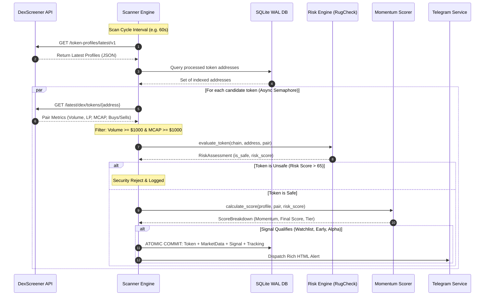

# Scanner Engine & Ingestion Pipeline

The **Scanner Engine** (`src/engine/scanner.py`) is the operational core of CRYPTO_ALPHA_SNIPER. It coordinates high-throughput token ingestion, parallel candidate inspection, risk validation, momentum scoring, database persistence, and alert dispatching.

---

## 🔄 Complete Pipeline Architecture

---

## 🔍 Stage-by-Stage Breakdown

### Stage 1: Profile Ingestion
* Queries DexScreener's `/token-profiles/latest/v1` endpoint.
* Returns up to 30 of the latest token profiles submitted or updated on decentralized exchanges.
* Handles HTTP 429 (Rate Limit) using exponential backoff.

### Stage 2: Deduplication & Chain Filtering
* Discards tokens on unsupported blockchains (configurable via `SUPPORTED_CHAINS`).
* Performs an indexed $O(1)$ set lookup against the `tokens` table in SQLite to avoid redundant re-analysis.

### Stage 3: Concurrency Control
* Token inspections run concurrently using `asyncio.gather`.
* To prevent outbound socket exhaustion and API rate-limiting, concurrency is bounded by `CONCURRENCY_LIMIT` (default: 10 parallel workers via `asyncio.Semaphore`).

### Stage 4: Pair Selection & Baseline Filters
* Queries `/latest/dex/tokens/{token_address}` to retrieve all active liquidity pools.
* Selects the dominant pair maximizing $\text{Score} = \text{Volume}_{h1} + \text{Liquidity}_{usd}$.
* Evaluates baseline criteria:
  * $\text{Volume}_{h1} \ge \text{MIN\_VOLUME\_USD}$ (Default: $1,000)
  * $\text{MarketCap} \ge \text{MIN\_MARKET\_CAP\_USD}$ (Default: $1,000)

### Stage 5: Security & Safety Evaluation
* Passes the token to the [Risk Engine](risk-engine.md).
* For Solana, calls RugCheck API to audit mint authority, freeze authority, and top holder concentration.
* If $\text{RiskScore} > \text{MAX\_ALLOWED\_RISK\_SCORE}$ (Default: 65), the token is **immediately rejected**.

### Stage 6: Multi-Factor Scoring
* Evaluates token age, velocity ($\text{VPM}$), transaction ratios ($\text{Buys}/\text{Sells}$), liquidity depth, and social presence.
* Categorizes qualified candidates into signal tiers: `ALPHA_SIGNAL`, `EARLY_SIGNAL`, or `WATCHLIST`.

### Stage 7: Persistence & Alerting
* Executes an atomic database transaction inserting:
  1. `Token` record
  2. `MarketData` snapshot
  3. `Signal` metadata
  4. Initial `Tracking` entry (for ROI benchmarking)
* Dispatches formatted HTML alerts to Telegram subscribers.
